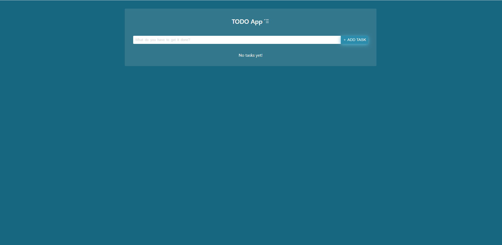
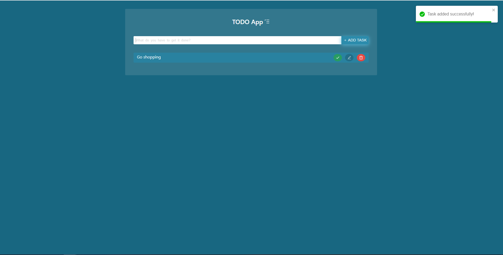
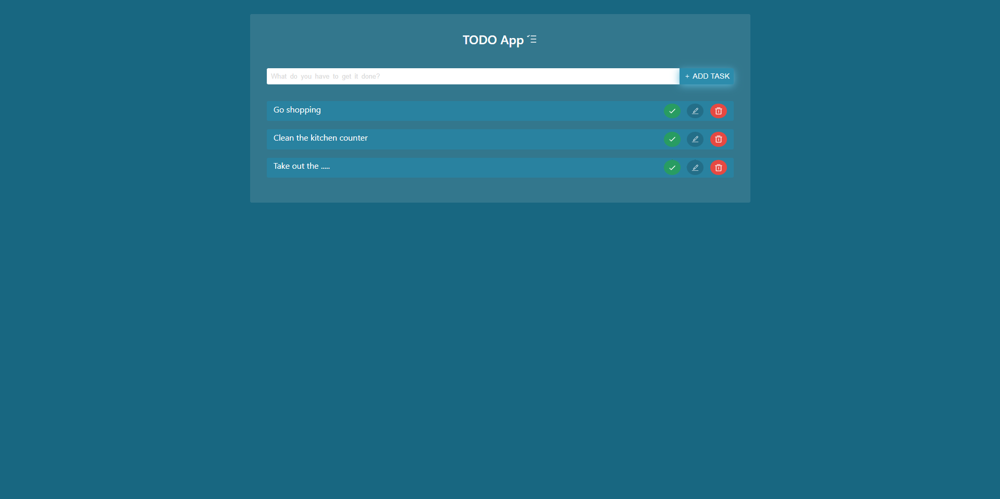
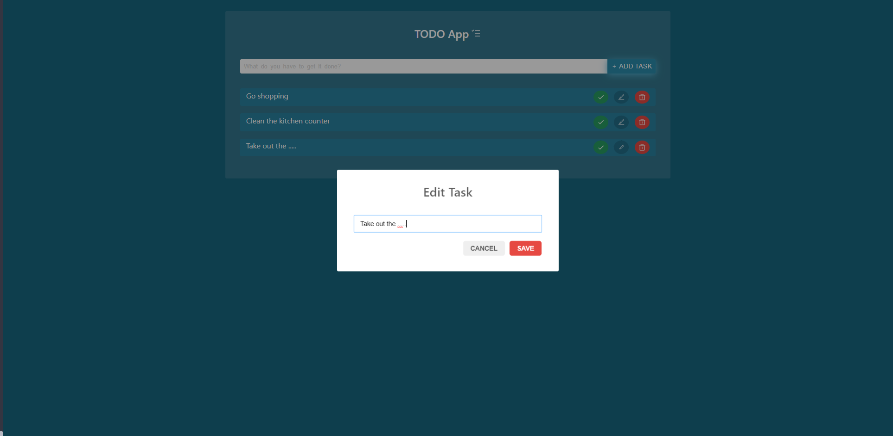
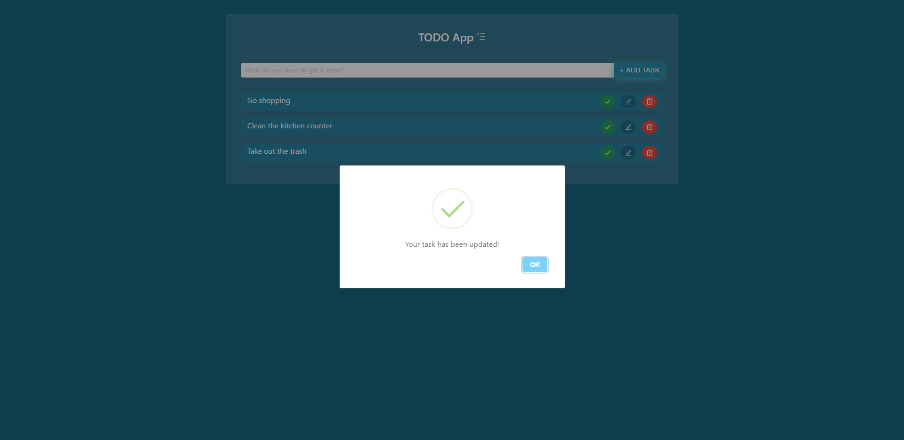
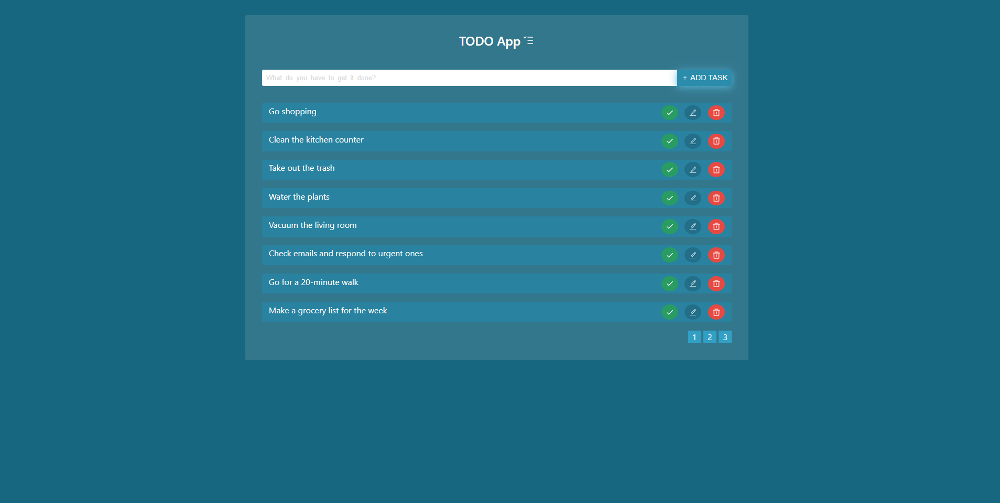
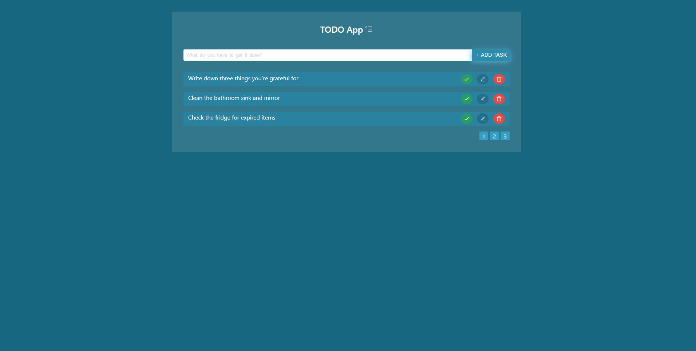
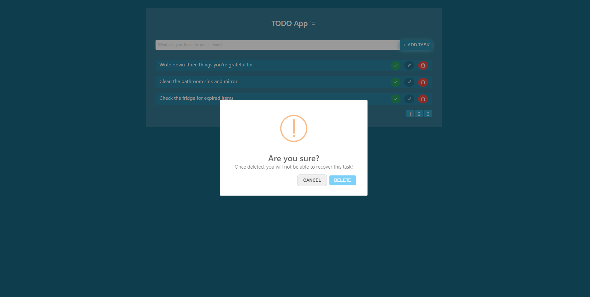
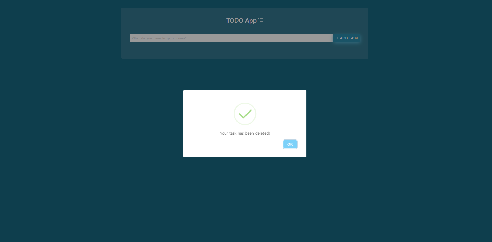

# TODO APP

This is a classical todo app, where users can add, edit, mark done and delete tasks.
The app is fully responsive and provides a nice UX.

## How to use

1. Where you want to save the project, open a terminal of your choice.
2. Clone the project by running this command `git clone https://github.com/M-Moussa-De/todo_app.git`.
3. Open the project using any IDE (e.g. VS Code).
4. In the terminal run `npm install` to install all dependencies.
5. In the terminal run `npm start` to start the development server.
6. A browser window will open and run the project.

## Features

- Add a task
- Edit a task
- Mark a task done
- Remove a task
- Tosts for notifications
- Validations
- Pagination
- Save tasks into the Localstorage to keep them persisting

## Used Tools and Technologies

- React JS
- Typescript
- React-Icons
- React-Tostify
- Sweetalert
- CSS / Sass
- Localstorage

## Screenshots

